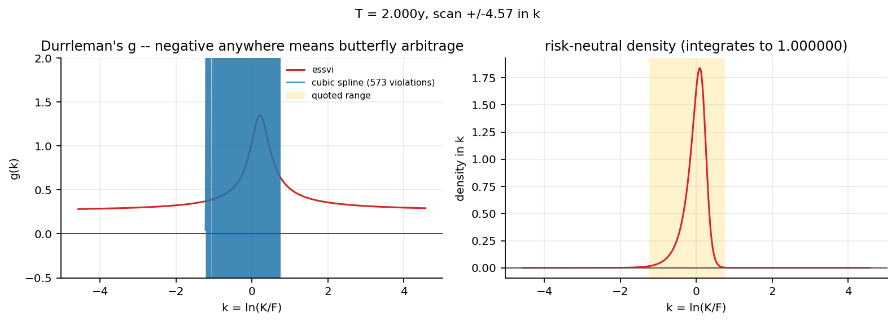

# qf-vol-surface-engine

An arbitrage-free implied volatility surface and multi-model option pricing
library. C++20 header-only core, pybind11 bindings, Python pipeline.

The organising idea is that a volatility surface is a probability distribution
or it is nothing. A cubic spline through the same quotes fits them exactly —
zero error, because it interpolates — and produces a risk-neutral density that
is negative over roughly half its range. It is the better fit by every measure
except the one that decides whether the surface can be traded against.



Every number in this README is measured. The authoritative copy is
[`benchmarks/RESULTS.md`](benchmarks/RESULTS.md), which `scripts/make_report.py`
generates from the benchmark binary's own JSON — nothing in *that* file is
transcribed. The figures quoted here are summarised from it by hand, so if the
two ever disagree, RESULTS.md is right and this file is stale.

---

## What it does

```python
from vsepy import Chain, surface, plots

chain, truth = Chain.synthetic()          # or Chain.from_csv("data/spy.csv", spot)
fitted = surface.fit(chain, "essvi")
print(fitted.summary())
```

```
essvi fit: 0.155 vol points RMSE, worst 0.540, 2.11 bid-ask spreads,
           2345 quotes, 22 ms -- arbitrage-free
         T   pts     rmse    worst  spreads      min g   min dens  integral   bf
    0.0192    55   0.1736   0.4710     1.58  2.586e-01  2.876e-64  1.000000   ok
    0.0822   122   0.1371   0.4535     1.43  2.636e-01  1.592e-60  1.000000   ok
    ...
    2.0000   863   0.1595   0.5399     2.29  2.821e-01  5.542e-27  1.000000   ok
  calendar: 0 violations
```

The fit quality and the arbitrage diagnostics arrive together, and there is no
way to ask for one without the other. That is deliberate: a surface 0.02 vol
points tighter that admits arbitrage is worse than one that is looser and does
not, because the arbitrage is the first thing a hedging strategy finds.

### The pipeline in one command

```
python scripts/build_surface.py --compare --heston
```

| method | RMSE | worst | spreads | ms | butterfly | calendar |
|---|---:|---:|---:|---:|---|---|
| eSSVI | 0.155 | 0.540 | 2.11 | 22 | free | free |
| SSVI | 0.570 | 3.676 | 6.89 | 31 | free | free |
| per-slice SVI | 0.148 | 0.478 | 2.03 | 110 | free | **164 violations** |

The tightest fit is the one that admits arbitrage, and that is not a
coincidence. The freedom that buys the last 0.007 vol points is freedom to let
adjacent slices cross.

---

## Measured results

The eleven headline metrics, in full with their conditions, are in
[`benchmarks/RESULTS.md`](benchmarks/RESULTS.md) alongside 98 individual
measurements. Summary:

| | Metric | Measured | Target |
|---|---|---|---|
| 1 | IV inversion accuracy | **4.7e-15** max relative, 0 non-convergent | < 1e-12 |
| 2 | IV inversion throughput | 4.1 M/sec C++, 2.54 M/sec from Python | 8–20 M/sec |
| 3 | Surface fit | **0.162** vol points, eSSVI, vega-weighted | 0.15–0.35 |
| 4 | Arbitrage violations | **0** butterfly, calendar conditions hold | 0 |
| 5 | Heston calibration | **220 ms**, 11 LM iterations, 5 parameters | 50–400 ms |
| 6 | Cross-method agreement | quadrature↔PDE 7.0e-4, MC within 0.08 se | < 1e-6 |
| 7 | MC variance reduction | **183×** fewer paths (conditional) | 20–60× |
| 8 | American accuracy | **0.32 bp** from a 4001-step lattice | 1–3 bp |
| 9 | LSMC duality gap | 33 bp at 800 inner paths | < 5 bp |
| 10 | AAD Greeks | **9.0×** bump-and-revalue, 10 risk factors | 8–20× |
| 11 | Invariant tests | **121 properties**, 46,002 assertions, 0 failures | 40+ |

Rows 2, 6 and 9 miss their targets. RESULTS.md says why, in the table rather
than in a footnote — briefly: the inversion is at its accuracy limit rather than
its speed limit (mean 2.42 iterations, with Cody's `erfcx` the cost); the PDE
figure is a statement about a 240×120×200 grid rather than about the method; and
the duality gap is dominated by the inner-simulation bias of the upper bound,
falling 230 → 138 → 67 → 33 bp as the inner path count doubles, while the lower
bound sits 6.2 bp from the reference.

**What the surface numbers were measured on.** Synthetic chains generated from a
known eSSVI surface with quote noise and tick rounding, not live market data.
A free delayed feed gives quotes that are asynchronous across strikes, so an
RMSE measured against one is partly a measurement of the feed. With a generating
surface the two can be separated, and are: the fit lands 0.054 vol points from
the surface that produced the quotes while sitting 0.155 from the quotes
themselves. Most of the apparent fit error is noise being correctly averaged
out, and there is no way to know that from the RMSE alone.
`scripts/fetch_chain.py` pulls a real chain for anyone who wants to run the
pipeline against one.

---

## What is in it

**Black-Scholes core.** The normalised Black function *b(x, s)* evaluated
through `erfcx` rather than through differences of the CDF, so it stays
relative-accurate deep in the wings where the naive form loses every significant
digit to cancellation. Cody's CALERF rational approximation, chosen after the
cheaper Hart and West forms measured 2.6e-9 relative error at |x| = 7 — enough
to put the inversion accuracy target out of reach.

**Implied volatility inversion.** Jaeckel's approach: a rational initial guess
by branch, then a Householder(3) step with the derivatives of *b* fused into one
`exp` call. Quartic convergence, so a step tolerance of 1e-5 lands at machine
precision. 4.66e-15 max relative error over a 10,000-point grid at 2.42 mean
iterations, no non-convergent points.

**Surface.** SVI, SSVI and eSSVI, with the Gatheral–Jacquier butterfly and
calendar conditions as closed-form checks on the parameters. The eSSVI form
builds the calendar condition into the parameterisation rather than penalising
it — ρψ is reparameterised so that the constraint is structural — which is why
it is arbitrage-free by construction rather than by inspection. Durrleman's *g*,
the Breeden–Litzenberger density and Lee's moment bounds are all available as
diagnostics.

**Chains.** Put–call parity regression recovers the forward *and* the discount
factor per expiry, weighted by inverse spread and restricted to near-the-money
strikes. Fitted rather than assumed, because an equity board prices off a
forward embedding a borrow cost and a dividend forecast that no published curve
knows, and an error there tilts the entire smile.

**Models.** Heston with the trap-corrected characteristic function (and the
removable singularities at *u* = 0 and *u* = −i handled algebraically, so the
martingale condition holds to 0 for thirty years); Lewis-integral and Carr–Madan
FFT pricers; Bates; SABR with Hagan's expansion and an arbitrage-boundary scan
that reports where the implied density goes negative.

**Numerical methods.** Crank–Nicolson with Rannacher startup on a
Tavella–Randall grid — measured gamma error 2.5e-5 with the startup against
1.0e+2 without, on the same grid; PSOR and Brennan–Schwartz for American
exercise; Craig–Sneyd ADI for the Heston PDE. Monte Carlo with Andersen's QE
scheme, Sobol sequences with Brownian-bridge construction, randomised QMC,
control variates and a conditional (Romano–Touzi) estimator. Longstaff–Schwartz
with an Andersen–Broadie dual bound.

**Adjoint differentiation.** A tape with each value carrying its tape pointer
rather than consulting a `thread_local` — the difference between 1.8× and 7.4×
the cost of an undifferentiated price, and it makes the tape thread-safe for
free. Ten Heston risk factors from one backward sweep.

---

## Build

```
cmake -G Ninja -DCMAKE_BUILD_TYPE=Release -S . -B build
cmake --build build
./build/vse_tests
python -m pytest
```

The Python extension is built by the same CMake invocation and lands in
`python/vsepy/`. Requires a C++20 compiler. Developed against gcc 15.2 (msys2
ucrt64) on Windows; CI builds and tests gcc and clang on Linux. The MSVC branch
in `CMakeLists.txt` is written but not exercised by CI, so treat it as
untested.

```
python scripts/make_report.py          # regenerate benchmarks/RESULTS.md
python scripts/build_surface.py        # the pipeline, with figures
python scripts/fetch_chain.py SPY      # a real chain into data/
```

---

## Layout

```
cpp/include/vse/   header-only C++20 core
cpp/tests/         121 property tests, 46k assertions
cpp/bench/         benchmark binary, emits JSON
bindings/          pybind11 module — no logic, no defaults of its own
python/vsepy/      chain cleaning, calibration drivers, plots
scripts/           fetch, pipeline, report generation
tests/             Python-side tests: the binding seam and the pipeline
benchmarks/        measured results, checked in
```

`data/`, `figures/` and build output are gitignored. The pipeline regenerates
them.

## Testing approach

The invariants tested are ones that hold for reasons independent of this
implementation, so a bug cannot satisfy them by agreeing with itself: put–call
parity, the no-arbitrage price bounds, monotonicity in volatility and maturity,
convexity in strike, density positivity and unit mass, the martingale property
of the characteristic function at *u* = −i, and the closed forms in every limit
where a model degenerates to Black–Scholes. Reference values come from mpmath at
60 digits, generated by `scripts/gen_reference.py` and checked in.

Several tests exist to pin down a *limitation* rather than a capability — the
Feller dependence of the pathwise variance Greeks, the region where Hagan's SABR
expansion implies a negative density, the short-dated smile Heston cannot reach.
A suite that only records what works is not evidence about anything.

## Licence

MIT. See [LICENSE](LICENSE).
